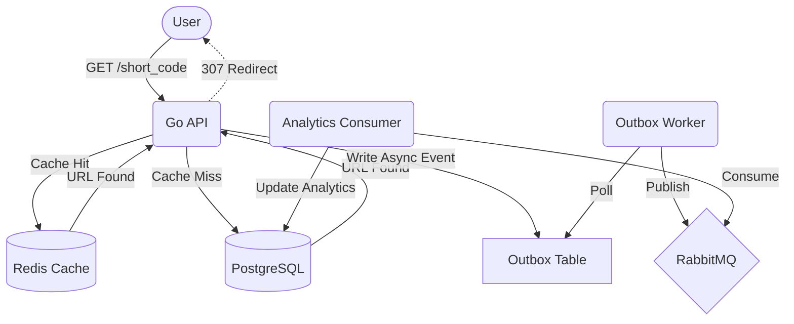

# URL Shortener

[](https://github.com/DanielCahya/URL-Shortener/actions/workflows/ci.yml)
[](https://golang.org/doc/devel/release.html)

## Overview

I built this URL shortener to explore advanced backend concepts. My goals for this project is to design a system capable of handling high throughput URL shortening and redirection while safely recording analytics without impacting the critical path.

The core API is written in Go. I used Redis as a cache aside layer for URL resolution to protect the primary PostgreSQL database during traffic spikes. For analytics tracking, the system implements a transactional outbox pattern to safely record click events locally, which a background worker then publishes to RabbitMQ for asynchronous processing by a separate consumer.

## Core Features

* URL creation with cryptographically secure short codes
* Custom aliases
* JWT authentication and refresh-token rotation
* Redis cache-aside URL resolution
* Rate limiting
* Idempotency protection
* PostgreSQL transactional outbox
* RabbitMQ asynchronous analytics processing
* Analytics API to view link statistics (by country, device, and browser)
* 307 Temporary Redirects
* Docker Compose development environment
* CI with automated formatting, linting, testing, and builds
* OpenAPI documentation
* Observability via Prometheus and Grafana

## Tech Stack

| Technology     | Purpose                |
| -------------- | ---------------------- |
| Go             | API / Backend Services |
| PostgreSQL     | Persistent data        |
| Redis          | Caching & Rate Limiting|
| RabbitMQ       | Asynchronous messaging |
| Docker         | Local development      |
| GitHub Actions | CI Pipeline            |
| Prometheus     | Metrics scraping       |
| Grafana        | Observability dashboard|

## Architecture

Data flows through the system using a combination of synchronous caching and asynchronous event processing.



## Project Structure

The project follows a standard Go project layout, organized by domain and dependency layer:

```text
cmd/api/           # Application entrypoint
docs/              # OpenAPI specifications
internal/          # Private application code
  auth/            # Authentication domain (handlers, services)
  cache/           # Redis implementations
  config/          # Environment configuration
  consumer/        # RabbitMQ consumers
  middleware/      # HTTP middlewares (rate limiting, idempotency)
  queue/           # RabbitMQ connection management
  repository/      # PostgreSQL queries and persistence
  url/             # URL domain (handlers, services, models)
  worker/          # Background tasks (outbox publisher, cleanup)
loadtest/          # k6 load testing scripts
migrations/        # PostgreSQL up/down migration files
```

## Running Locally

You can spin up the entire stack (API, PostgreSQL, Redis, RabbitMQ, Prometheus, and Grafana) using Docker Compose. No local Go installation is required.

1. **Clone the repository:**
   ```bash
   git clone https://github.com/DanielCahya/URL-Shortener.git
   cd URL-Shortener
   ```

2. **Start the services:**
   ```bash
   docker-compose up -d --build
   ```

3. **Access the application:**
   - **API:** `http://127.0.0.1:8080`
   - **Grafana:** `http://127.0.0.1:3000` (Login: `admin` / `admin`)
   - **RabbitMQ Management:** `http://127.0.0.1:15672` (Login: `guest` / `guest`)

4. **Stop the services:**
   ```bash
   docker-compose down -v
   ```

## API Documentation

The complete OpenAPI 3.0 specification is available at `docs/openapi.yaml`. You can import the file directly to Postman, Insomnia, or Swagger UI to interact with all documented endpoints.

## Testing

While running the application via Docker doesn't require Go, executing the test locally does. If you want to run the tests, ensure you have Go 1.26.0 installed and run:

```bash
go test -v ./...
```

The CI pipeline automatically runs `go fmt`, `golangci-lint`, and all tests on every pull request to ensure code quality.

## Observability

The project includes built-in observability:
* **Prometheus** scrapes application metrics via the `/metrics` endpoint on the Go API.
* **Grafana** visualizes these metrics, allowing you to monitor HTTP request latencies, total requests, rate limit rejections, cache hits/misses, and active database connections.

## Design Decisions

* **307 Temporary Redirects:** Used instead of 301 Permanent Redirects to ensure that browsers not aggressively cache the redirect locally. This can guarantees that every click hits the API so we can accurately track the analytics.
* **Cache-Aside Redis:** Protects PostgreSQL from heavy read loads. On a cache hit, the API resolves the URL almost instantly. On a cache miss, it reads from the database and populates Redis for subsequent requests.
* **Transactional Outbox:** To prevent slow redirects, analytics data (like IP, device, and browser) is quickly written to a local `outbox` table within the same transaction footprint as the URL fetch. A separate background worker safely polls this table and pushes the events to RabbitMQ.
* **Idempotency Protection:** URL creation endpoints require an `Idempotency-Key` header. If a client retries a request due to a network timeout, the idempotency middleware (backed by PostgreSQL) ensures the exact same response is returned without creating duplicate database records.